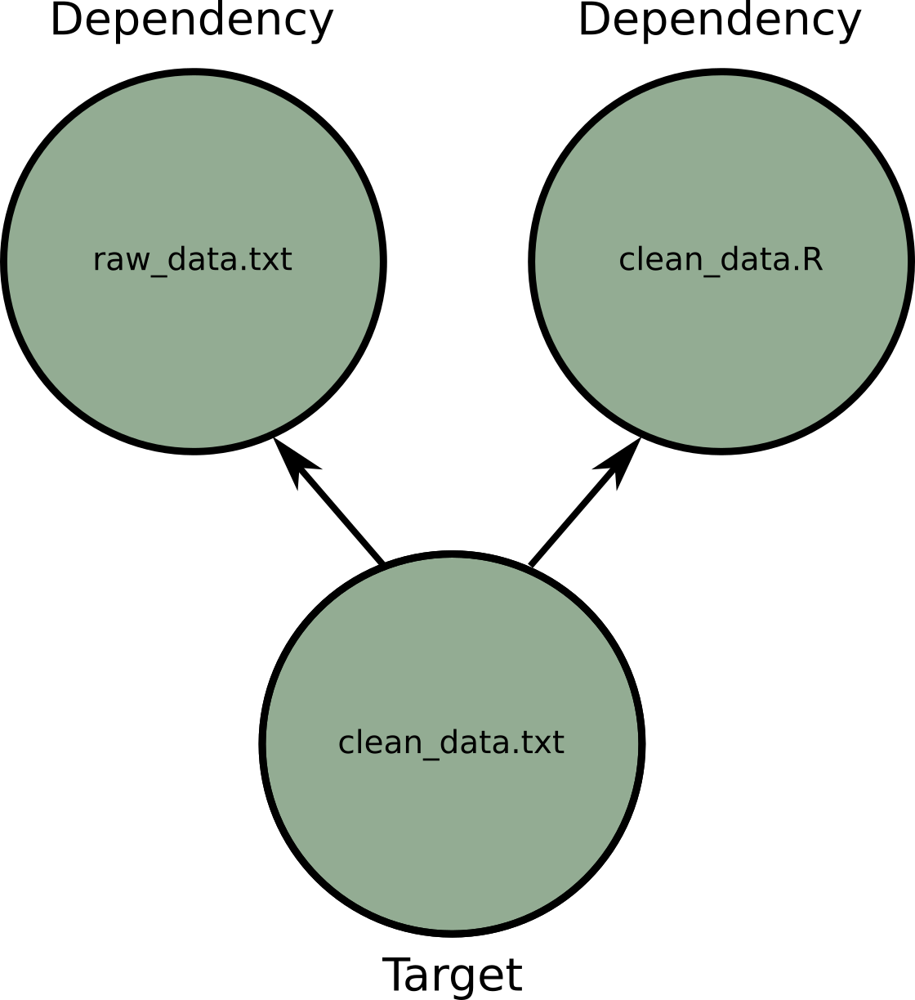
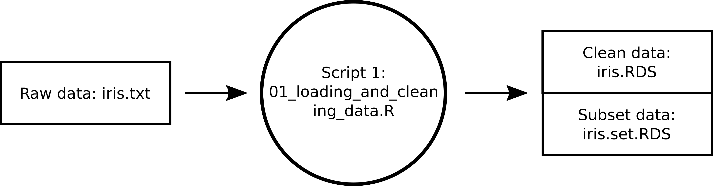
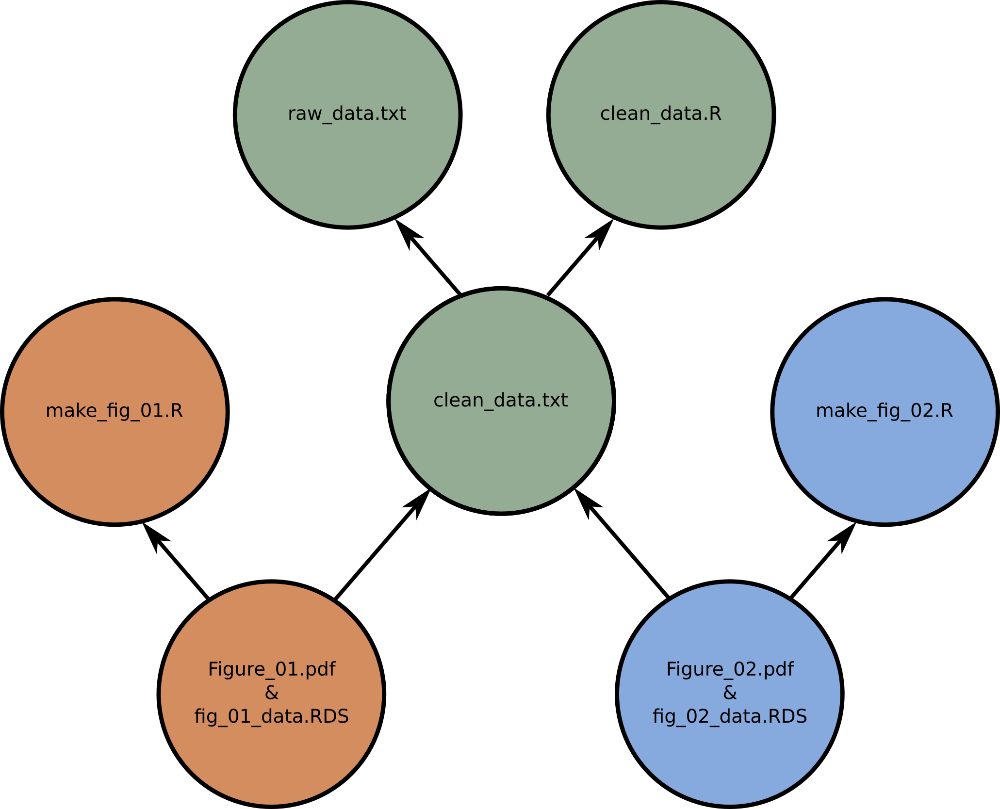
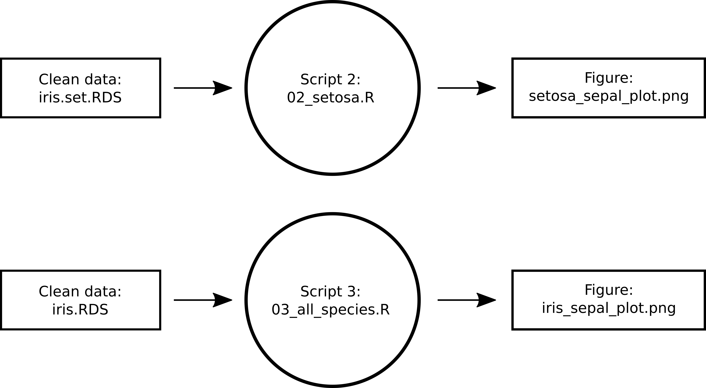

````{r knitr setup, include=FALSE}
# some setup options for outputing markdown files; feel free to ignore these
# These are the default options for this report; more information about options here: https://yihui.name/knitr/options/
knitr::opts_chunk$set(eval = FALSE, # evaluate code chunks
                      include = TRUE, # include the console output of the code in the final document
                      echo = TRUE, # include the code that generated the report in the final report
                      warning = FALSE, # include warnings
                      message = FALSE, # include console messages
                      collapse = TRUE, # Merge code blocks and output blocks, if possible.
#                      dpi = 300, # the default figure resolution
#                      fig.dim = c(6, 5.5), # the default figure dimensions
                      cache = TRUE) # save the calculations so that kniting is faster each time. (Sometimes this option can cause issues and images won't reflect the most recent code changes, if this happens, just delete the *_cache folder and reknit the code.)
````

# Getting Started
## Materials 
You don't have to participate at home, but if you want to participate at home, you will need:

>1. To download the make_example file from github [link]
>2. Move the file to a place that you will be able to easily navigate to with the terminal, for example your Desktop
>3. Open your terminal and navigate to that location. 

For example `cd ~/Desktop`

>4. Use the terminal to unzip the example file, and then move inside of it.

  `unzip make_example.zip`  
  `cd ~/Desktop`  

## Resources/Links/Inspiration:
Today's presentation is heavily inspired by:

1. Software Carpentry's lesson in makefile
   - [https://swcarpentry.github.io/make-novice/](https://swcarpentry.github.io/make-novice)
2. Karl Broman's "minimal make" tutorial
   - [https://kbroman.org/minimal_make](https://kbroman.org/minimal_make)


# Why you should care
## **Scenario 1:**
You realize you made a mistake in the lab or field and now need to replace your old data with the new, more accurate data. You do so and re-run your analysis. Then you receive data from a collaborator that you've been waiting on for months. Yay! Some of your figures depend on this data and some don't. You updated your code and then re-run the whole thing from start to finish just to be sure. The collaborator tells you that one of the samples in the previous data they sent you was a mistake. You should remove it from the analyses. You now need to run everything again but without this one data point.
 
## **Scenario 2:**
Your advisor or a reviewer asks you to redo an analysis in a slightly different way. You internally groan. Although you have all the code and the change is relatively small, the change is at the very beginning of your computational pipeline. You are going to have to re-run 20 steps one at a time to incorporate the change. Some of the steps take quite a long time to run but others take only a short time, very few of the steps take a convenient amount of time in which you could get something useful done. You spend an entire day of work pressing "enter" and doing small tasks on the side.

## **Scenario 3:**
You make a small change to a script that results in changes to only one of your figures, because you can't remember the exact dependencies of your pipeline, you re-run the whole pipeline to make sure every thing is updated. Or worse, you don't re-run the whole pipeline and one of your statistics is incorrect. You can't understand why you are getting this weird outcome. It takes you months to realize the issue. Or you never do. Oops.
 
<!-- ## **Scenario 4:** -->
<!-- A collaborator asks you for your code so they can build on some of your analyses. You say yes of course, then you realize, they won't be able to run this part of it with out some other part of the pipeline. Or if they run one script (step 4) they will need to run the scripts for step 1 and step 2 (but not step 3) in order for it to work properly. You realize you now have several choices 1) send them all of your code and write them a lengthy email explaining the idiosyncrasies of your pipeline (and hope you don't forget anything), 2) run the analysis for them instead of giving them the code, 3) create a custom analysis script just for their use. To your dismay each of these options will use a lot of time (either you or your collaborator's) even though the initial request was fairly straightforward. -->

## **Why should we be using makefiles?**

>1. Reproducible analysis with minimal brain input
>2. Self-documenting pipeline
>3. More efficient use of your time and energy

## **Challenges of make**

>1. Weird rules and idiosyncrasies
>2. Can have cryptic error messages
>3. Requires a bit of knowledge about the unix shell

## Today's goal:

Learn to use `make` for your pipelines with minimal background knowledge. 

# Introduction to `make` 

## `make` is a program that executes instructions in a makefile
 - `make` looks for a file called "Makefile" and runs all of the instructions in the makefile
 - By default it assumes your makefile is called "Makefile", but you can specify different file name if you want using the `-f` flag
 
### How to run make:
```{bash}
[you@localhost make_example]$ make
[you@localhost make_example]$ make -f mymake.txt

```

# **How to write makefiles**

## **Anatomy of a makefile**

### Anatomy
```{bash}
# Makefile structure
target: dependency
	action
```

###

 - *target*: output files that you are trying to make

 - *dependency*: the files (including scripts and data), that your outputs depend upon

 - *action*: a command that can be run in a terminal that describes what to do with the dependencies.


***

```{r, eval = TRUE, echo = FALSE, out.height="80%", fig.align="center"}

```


## **Anatomy of a makefile**

```{r, eval = TRUE, echo = FALSE, out.height="40%", fig.align="right"}

```


### Makefile 
```{bash}
# Makefile structure
clean_data.txt : clean_data.R raw_data.txt
	R CMD BATCH clean_data.R

```


## Important Syntax:

The second line **must** begin with a TAB, not spaces.


### Action lines must begin with tab
```{bash}
# Makefile structure
clean_data.txt : clean_data.R raw_data.txt
	R CMD BATCH clean_data.R # This line starts with TAB
	
```


## Important Syntax:

The first line must be on one line from the computer's perspective. But you can break it up into multiple human-readable lines with line breaks (backslashes) for easy reading.


### Without a line break
```{bash}
Figure_01.pdf fig_01_data.RDS: make_fig_01.R clean_data.txt
	R CMD BATCH make_fig_01.R
```	

### With a line break
```{bash}
Figure_01.pdf \ 
fig_01_data.RDS: make_fig_01.R clean_data.txt
	R CMD BATCH make_fig_01.R
```	

## Important Syntax:

The action line must be a command that can be run in the terminal. You can use as many actions as necessary to complete your task.

 - To run an R script in the terminal use either `R CMD BATCH myscript.R` or `Rscript myscript.R`. 


### Action lines must be executable in the terminal
```{bash}
# Makefile structure
clean_data.txt : clean_data.R raw_data.txt
	R CMD BATCH clean_data.R # executable in the terminal
	
```

## In summary:

>1. Begin each action with a TAB 
>2. Use line breaks if you have to break up the first line. 
>3. Construct actions so that they can be run in a terminal.

## Your turn: Write a makefile called "Makefile" for the following workflow
 - Save your makefile in the folder called "make_example"
 - R scripts can be run with `R CMD BATCH myscript.R`




```{bash}
# Makefile structure
target: dependency
	action
```

## Your turn: Writing a makefile


### Makefile_00
```{bash}
# Cleaning Data =========================================

# Files from 01_loading_data_and_cleaning_data.R
iris.RDS \
iris.set.RDS: 01_loading_and_cleaning_data.R iris.txt
	R CMD BATCH 01_loading_and_cleaning_data.R

```

## Your turn: Running your makefile

Makefiles only run a step if the dependencies have been updated (i.e. if their time stamps have changed).

### The first time you run
```{bash}
[you@localhost make_example]$ make
R CMD BATCH 01_loading_and_cleaning_data.R
```

### The second time you run
```{bash}
[you@localhost make_example]$ make
make: 'iris.RDS' is up to date.
```

### After a timestamp has been updated
```{bash}
[you@localhost make_example]$ touch iris.txt
[you@localhost make_example]$ make
R CMD BATCH 01_loading_and_cleaning_data.R
```


## Errors

Make has cryptic errors, so let's go through some of them now.

***

If you accidentally forget a line break or use spaces instead of a tab for the second line you'll see the following error:

### Missing seperator error
```{bash}
[you@localhost make_example]$ make
Makefile:5: *** missing separator.  Stop.
```
***

If your action line is not able to run, you'll get a much more cryptic error usually with "Command not found". 

### Execution error
```{bash}
[you@localhost make_example]$ make
make: 01_loading_and_cleaning_data.R: Command not found
make: *** [Makefile:9: iris.RDS] Error 127
```

***

### Other errors
Any other cryptic errors, may be the result of a bug in your script. You can check the output file (for R, it's .Rout) to search for clues. 

## Errors Summary:

>1. "missing seperator"" --> check your tabs, linebreaks, and spaces 
>2. "Command not found" --> Is your action line something that can be run in the terminal?
>3. Other error --> Check your script for bugs


## Important!! Your dependencies *must not* be circular

If any of your dependencies are circular (Figure_01 depends on on Figure_02 and vice versa) then your makefile will always run both, regardless of the timestamps and the order it will run them in will be arbitrary.

## Dealing with Multiple targets

```{r, eval = TRUE, echo = FALSE, out.height="80%", fig.align="center"}

```

***

```{r, eval = TRUE, echo = FALSE, out.height="20%", fig.align="right"}

```

### Makefile
```{bash}
# Makefile structure
clean_data.txt : clean_data.R raw_data.txt
	R CMD BATCH clean_data.R

Figure_01.pdf fig_01_data.RDS: make_fig_01.R clean_data.txt
	R CMD BATCH make_fig_01.R
	
Figure_02.pdf fig_02_data.RDS: make_fig_02.R clean_data.txt
	R CMD BATCH make_fig_02.R
```

***
 - By default, `make` will only build the first target and any of its dependencies so you have to specify what you want to create. 

### Makefile
```{bash}
# Makefile structure
clean_data.txt : clean_data.R raw_data.txt
	R CMD BATCH clean_data.R

Figure_01.pdf fig_01_data.RDS: make_fig_01.R clean_data.txt
	R CMD BATCH make_fig_01.R
	
Figure_02.pdf fig_02_data.RDS: make_fig_02.R clean_data.txt
	R CMD BATCH make_fig_02.R
```

### To create Figure_01.pdf:
```{bash}
[you@localhost make_example]$ make Figure_01.pdf
```


## "Phony" targets are a convenient way to group targets together

Since we don't want to have to type a new command for every figure in our workflow, we can create a target of targets (also called a "Phony" target) to create all of our figures at one time. 

### Makefile
```{bash}
.PHONY : figures

figures : Figure_01.pdf Figure_02.pdf

# Makefile structure
clean_data.txt : clean_data.R raw_data.txt
	R CMD BATCH clean_data.R
...

```

---

### To create our figures:
```{bash}
[you@localhost make_example]$ make figures


```

OR
```{bash}
[you@localhost make_example]$ make
```

## Your turn: Phony targets

Add the following steps to your workflow and then create a Phony target for the figures. 



***

### Makefile_01
```{bash}
.PHONY : figures

# Figures =============================================
figures: iris_sepal_plot.png \
setosa_sepal_plot.png

# Cleaning Data =======================================
...
# Analyses =============================================

# All species together
iris_sepal_plot.png: 03_all_species.R iris.RDS
	R CMD BATCH 03_all_species.R

# Setosa
setosa_sepal_plot.png: 02_setosa.R iris.set.RDS
	R CMD BATCH 02_setosa.R
```

## Default targets

Let's say that most often you will be (re)making your figures. You can save yourself some typing by telling `make` explicitly to make figures the default target. `figures` will then be the default target regardless of its position in the makefile. For example:

### Makefile
```{bash}
.PHONY : figures
.DEFAULT_GOAL := figures

# Figures =============================================
figures: iris_sepal_plot.png \
setosa_sepal_plot.png
...

```

Solution: Makefile_01

## Your turn: Run your makefile

### To create our figures:
```{bash}
[you@localhost make_example]$ make figures


```

OR
```{bash}
[you@localhost make_example]$ make
```

## Other oddities of `make`: Only one-line actions are allowed

If you need to change directories to run a command or do any other action that normally uses multiple steps, you must do it on one line with line-breaks. For example:

### Changing directories
```{bash}
# Makefile structure
clean_data.txt : R/clean_data.R raw_data.txt
  cd R;\
	R CMD BATCH clean_data.R

Figures/Figure_01.pdf fig_01_data.RDS: R/make_fig_01.R clean_data.txt
  cd R;\
	R CMD BATCH make_fig_01.R

```

## Other oddities of `make`: The "@" prefix

By default all action lines are printed to the terminal as they are run. Preface an action line with "@" to print the results of the command rather than the command itself. For example:

***

### Makefile
```{bash}
.PHONY : figures
.DEFAULT_GOAL := figures

figures : Figure_01.pdf Figure_02.pdf
  @echo "Made figures"
...
```

### Running makefile
```{bash}
[you@localhost make_example]$ make figures
R CMD BATCH clean_data.R
R CMD BATCH make_fig_01.R
R CMD BATCH make_fig_02.R
Made figures
```

# Housekeeping and Good Coding Practices
## make clean
Often your workflow produces many files, some of which are temporary and can be removed. It's also fairly common that you might want to force make to rerun all of your analyses from the beginning. This is often taken care of by creating a target called `clean` which removes your unwanted files.

### `make clean`
```{bash}
# Makefile Cleaning ====================================
clean: remove-figures remove-R-outputs

remove-figures:
	rm -f *.png
	rm -f *.pdf

remove-R-outputs:
	rm -f *.Rout
	rm -f *.RDS

```

---

### To clean our directory:
```{bash}
[you@localhost make_example]$ make clean
rm -f *.png
rm -f *.pdf
rm -f *.Rout
rm -f *.RDS


```

Or to only remove R-outputs
```{bash}
[you@localhost make_example]$ make remove-R-outputs
rm -f *.Rout
rm -f *.RDS
```

## Your turn: Add a clean section to your makefile
Add a section that removes all files ending in ".png", ".pdf", ".Rout", and "*.RDS" to the iris workflow makefile. Don't forget to add the new section to your list of phony targets.

Solution: Makefile_02

## Self-documenting makefiles
To prevent you from forgetting what each of your phony targets does, you can add a self-generating help section to your makefile. 

 - Let's say that everytime we add a new section to our makefile, we write a little about it, prefaced by `##` or some other consistent character pattern. 

***
### Documentation
```{bash}
.PHONY : figures
.DEFAULT_GOAL := figures

# Figures =============================================
## figures: makes figures for all iris species and for setosa alone. 
figures: iris_sepal_plot.png \
setosa_sepal_plot.png

...
# Makefile Cleaning ====================================
## clean: cleans files ending in ".png", ".pdf", ".Rout", and "*.RDS"
clean: remove-figures remove-R-outputs
...

```

## Self-documenting makefiles
Then, we can create a new section called "help", that uses the search-and-replace program sed to create documentation. The target `help` will depend on the makefile itself.

### Documentation
```{bash}
help: Makefile
	@echo "Targets to make:"
	@sed -n 's/^##/     /p' Makefile
	@echo ""
```

## Your turn: Add a help section
 1. First add the help target to the end of your makefile. 
 2. Then add lines that begin with `##` before each target to create the documentation.

### Help target
```{bash}
help: Makefile
	@echo "Targets to make:"
	@sed -n 's/^##/     /p' Makefile
	@echo ""
```

# Advanced Tips and Tricks

## Shortcuts 
Makefiles can be made less repetitive and more reliable to changes in file names by using shortcut variables.

### Shortucut Variables
* $@ = "the target of the current rule"
* $^ = "all the dependencies of the current rule"
* $< = "the first dependency of the current rule"
* $(@D) = "the directory part of the target"
* $(@F) = "the file part of the target"
* $(<D) = "the directory part of the dependency"
* $(<F) = "the file part of the dependency"

### More information
For a more in-depth tutorial on reducing repetition in your makefile see steps 3 - 7 in [https://swcarpentry.github.io/make-novice/](https://swcarpentry.github.io/make-novice)

## Advanced Makefile for an R output

Check out the Makefile for the make_example_advanced folder for an example of a more advanced makefile that deals with directory structures. 